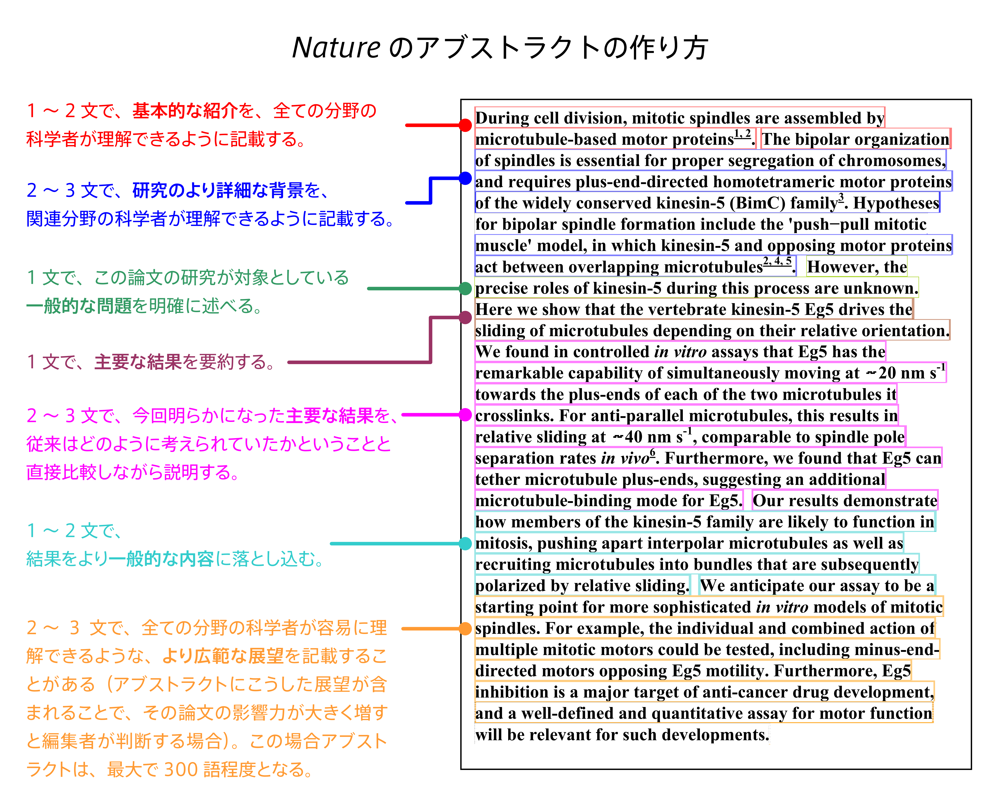
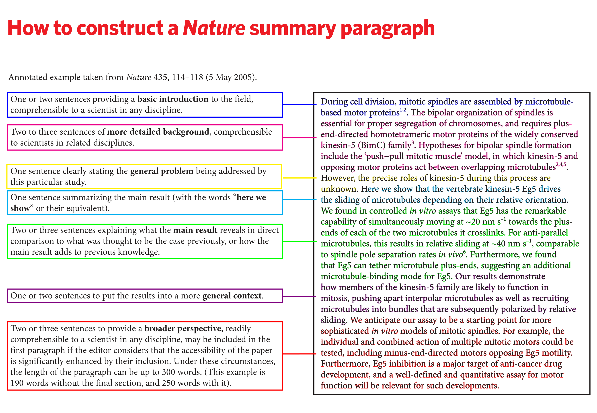

# memo

## LaTeX入門サイト

https://www.learnlatex.org/ja/

https://www.learnlatex.org/en/

How to publish a scientific manuscript in a high-impact journal

Emad El-Omar
Professor of Medicine, University of New South Wales

https://www.sciencedirect.com/science/article/pii/S2351979714000838

"Writing a cover letter to the editor-in-chief"

> In the cover letter to the editor, your aim is to “sell” your paper to the journal. You only have ONE shot at it, so you MUST get it right. Great care should be taken to attract the editor's attention and provide a reason for sending your paper out for external peer review. You should avoid careless mistakes (which sadly happen frequently!) such as addressing the letter to the wrong editor or even to the wrong journal! Tips on writing a good cover letter include:
>
> * Address the editor-in-chief (EIC) by name. This implies that you know the journal's editorial committee and have bothered to check.
> * Avoid making a mistake in the name of the editor or the journal! This happens when authors send their rejected paper to the next journal without changing anything!
> * Ensure that your letter is not too short or too long and that it does not simply repeat the abstract.
> * Highlight the novel aspect of your work and why the journal readership would find this important.
> * Indicate why this work fits the journal's remit and scope.
> * You may wish to let the EIC know whether your manuscript was rejected by another journal, and attach previous reviews and your response to them.
> * Make sure your cover letter contains these sentences: “We confirm that this manuscript has not been published elsewhere and is not currently under consideration by another journal. All authors have approved the manuscript and agree with its submission to this journal.”
>

## Nature journals guide to authors

https://www.natureasia.com/pdf/nature/authors/gta-2017.pdf
https://www.natureasia.com/pdf/ja-jp/nature/authors/gta-2017.pdf

## Twitter post

https://x.com/ossanworld/status/2010855411185058016
西川裕章（方手雅塚）
@ossanworld

> 学会で見る多くのプレゼンテーションが「Thank you」とだけ書かれたスライドで終わる。今日参加したセッションでは、その他に「Acknowledgements」スライドや、何と「End」とだけ書かれたスライドで終わったプレゼンもあった。それを見せたまま、「質問をどうぞ」とくるが、私はいつも結論が書かれたスライドに戻して欲しいと思う（お願いすることもある）。
> 　そんな中、一人の学生が「結論」スライドを見せたままプレゼンを終え、私は感心した。私は思わず、「結論を見せたまま終わる、素晴らしいプレゼンの終わり方だ」とコメントした。後で話してみると、その学生はそれが聴衆にとって研究内容について色々と考え、質問を思いつく良い機会になることを理解していた。
> 　是非ともポスドクとして雇いたいと思ったが、まだ博士課程2年目とのこと。「卒業が近づいたら連絡を」と言って名刺を渡した。

## 科学

科学論文作成上のルール
荒瀬 康司

https://www.jstage.jst.go.jp/article/ningendock/34/1/34_6/_article/-char/ja/

## How to design an award-winning conference poster

https://blogs.lse.ac.uk/impactofsocialsciences/2018/05/11/how-to-design-an-award-winning-conference-poster/

Above all, a poster should be a networking tool. The primary purpose of a poster is not to communicate every little detail of your fantastic research, but rather to attract people’s attention and serve as a conversation starter. Think about the typical conference poster session; it’s at the end of the day, and there is often a copious amount of alcohol in the mix. Seriously, after a long day of presentations, no one wants to read walls of text as the wine kicks in. What they want is for you to share the story of your research and engage in informal conversation about it. Repeat after me: a poster is a conversation starter. And the poster is not going to do the talking for you.

Second, a poster is a communication tool. A poster should use visuals to draw people in from a distance. Then, as people step closer and begin reading it, go ahead and give the background information necessary so that they can put your work into context, understand what you have done, why you have done it, and come to realise its broader impact.

Contact information: it may seem strange, but a lot of people forget to write their contact information on their posters. You may have a stunning poster, but how are people going to contact you and offer you a postdoc if you’re not around and your email is not on the poster? Even better, put a few business cards or a miniature A4 version of the poster (with contact info) beside the poster for people to take. This will have you looking very professional!

Oh, and one last thing. Remember when I said that a poster is a conversation starter? It’s true, so you need to prepare and sharpen your pitch! Practice walking people through your poster in about a minute, and then start a conversation with them. How? Asking them what they work on is a good start. The secret to a good conversation is showing interest and listening. People love to talk about themselves and their research, so let them talk! It’s as easy as that.

## Twelve scientist-endorsed tips to get over writer’s block

https://www.nature.com/articles/d41586-024-02013-4

## Proposition

https://math.stackexchange.com/questions/25639/lemma-proposition-theorem-which-one-should-we-pick

## Mathematical Reasoning: Writing and Proof

https://math.libretexts.org/Bookshelves/Mathematical_Logic_and_Proof/Book%3A_Mathematical_Reasoning__Writing_and_Proof_(Sundstrom)/zz%3A_Back_Matter/21%3A_Appendix_A%3A_Guidelines_for_Writing_Mathematical_Proofs

## Springer

https://www.springernature.com/gp/authors/publish-a-book/manuscript-guidelines

Sans serif (e.g., Arial) and nonproportional font (e.g., Courier) can be used to distinguish the literal text of computer programs from running text.

Technical terms and abbreviations should be defined the first time they appear in the text.

## argmin

argmin
https://tex.stackexchange.com/questions/5223/command-for-argmin-or-argmax

## clever ref appendix

https://tex.stackexchange.com/questions/119513/cleveref-and-appendix-packages-appendix-referenced-as-section

## autonum

https://qiita.com/t_kemmochi/items/a4c390b4967b13f3afb7

## iguana tex

todo
